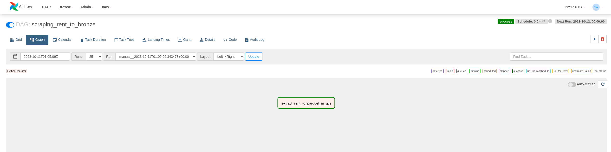
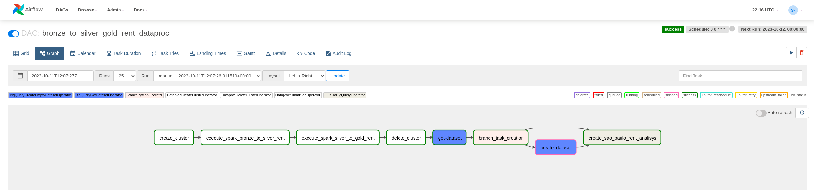
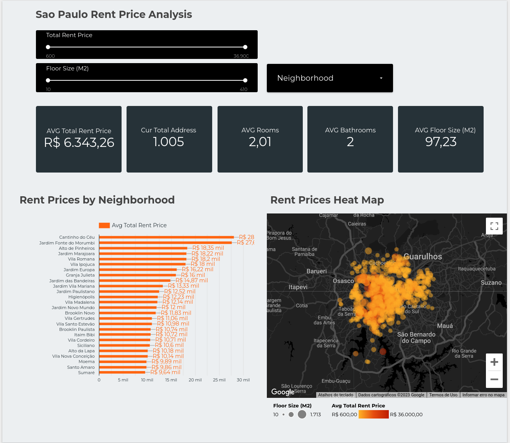

# Sao Paulo Rent Price Analysis

## This is a Data Engineering Project that focuses on Web Scraping an apartment renting web page filtered in Sao Paulo and Google Cloud Platform Tools being orchestraded by Airflow

### How everything was set up

* Airflow:
    Airflow was configured in Cloud Composer, it is easier to build and already had all GCP's connections I needed for this project.
    The only configuration I made was the Python dependencies: pandas, beautifulsoup4, pyarrow.

#### Scraping to Broze DAG

The [Scraping to Bronze DAG](dags/scraping_rent_to_bronze.py) has one task that checks the day of the week so it can tell the scraping script which pages to get info from (so it doesnt repeat mucb information in other days) then the scraping returns a pandas DataFrame that is transformed into a parquet file and sent to Google Cloud Storage with its API. It is setted to run every night at midnight.

* Scraping and Sending to GCS:
    The Scraping process was based on the beautifulsoup4 lib and the web page it gets information and the task uses PythonOperator. With this I created 3 classes: [Web Page](dags/custom_modules/rent_extractor/beatifulsoup_abstract/b4s_abstractor_soup.py) - Gets the secction with all the info I need in the page; [Specific Infos](dags/custom_modules/rent_extractor/beatifulsoup_abstract/b4s_abstractor.py) - Gets infos in the web page that I use to create the columns for the DataFrame; [Create DataFrame](dags/custom_modules/rent_extractor/apartment_extractor.py) - By using the classes above I can create a pandas DataFrame that contains the price (monthly rent price), total_price (total sum of the rent price with taxes and condominium price), address, floor_size, number_of_rooms, number_of_bathrooms. Finally it is created the parquet file and sent to Google Cloud Storage by using the gloud.storage library.

#### Bronze to Silver to Gold DAG

The [Bronze to Silver to Gold DAG](dags/scraping_rent_to_bronze.py) has eight tasks, it is the dag that refines, aggregates and sends the data to BigQuery so it can be served at Looker Studio. It is setted to run every night at midnight.

* Dataproc Cluster Creation:
    To create the cluster I used the DataprocCreateClusterOperator, configuring it with a two cores master and worker machine with a init script that enables pip install, so it can install the googlemaps package so I can aggregate Geocode informations into the Gold Layer.

* Refinement:
    After creating the Dataproc Cluster I can proceed to run the first Spark task: [Bronze to Silver Task](dags/custom_modules/spark_scripts/spark_rent_extraction_bronze_to_silver.py). The task is run by the DataprocSubmitJobOperator, and it is refined by cast columns to different types using regexp_replace to take out the letters that came with price info so it can become Intergers or even the size of the apartments that came with the units (m2). And then the data is written in Google Cloud Storage (Silver Layer).

* Aggregation:
    As mentioned earlier I needed the googlemaps lib to create new columns with the Geocode method, so the last Spark task ([Silver to Gold Task](dags/custom_modules/spark_scripts/spark_rent_extraction_silver_to_gold.py)) creates the latitude and longitude columns with a UDF that applies the googlemaps geocode method by using the address column. The last column is to create the neighborhood information. And then the data is written in Google Cloud Storage (Gold Layer).

* Dataproc Cluster Deletion:
    With the objective of not letting the cluster doing nothing and aggregating costs, the best decision is to delete the cluster after runing the spark tasks using the DataprocDeleteClusterOperator.

* Checking BigQuery Dataset:
    This one is very simple, by using the BigQueryGetDatasetOperator I'm able to check wheather the Dataset exists (the task succeds) ou not (the task fails).

* Branching creation tasks:
    If the get dataset task fails, then the dataset creation is chosen if it succeds then the table creation/update is selected.

* BigQuery Dataset Creation:
    Using the BigQueryCreateEmptyDatasetOperator I create the dataset that will hold the gold table.

* BigQuery Table Creation/Update:
    The creation or update of the table in BigQuery, requires the data origin, the destination and its schema. I used the GCSToBigQueryOperator so it can read the parquet stored in the gold table directory in GCS and send it to BigQuery.

#### Visualization

The DataViz was made in Looker Studio, since it has native conection to BigQuery. The Dashboard is located in the [Link](https://lookerstudio.google.com/reporting/c7248abc-b7e2-4711-bc2b-1782715f312d/page/9OveD). It contains analysis of the Sao Paulo Apartment Renting Prices and other informations.

What I want to show here is the avarage apartment you can find in each neighborhood and to also analyse it individualy.
